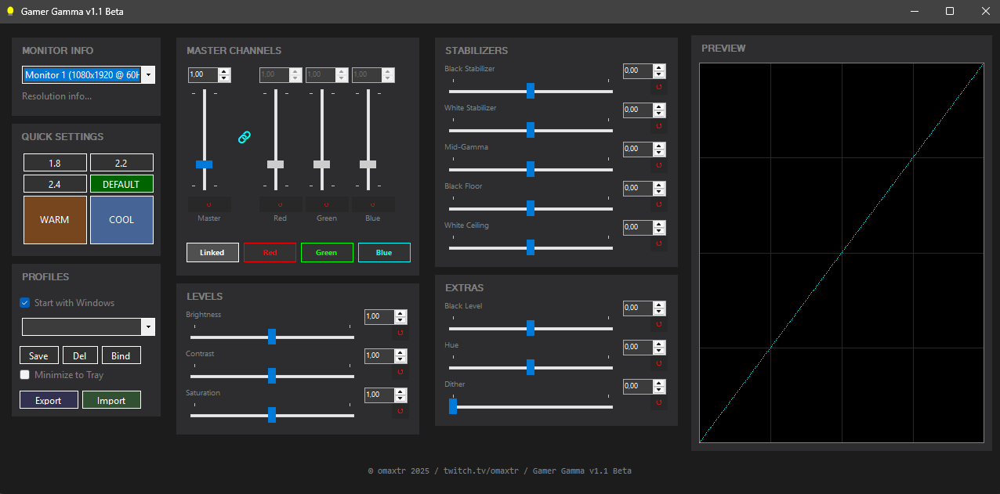

# Gamer Gamma v1.0 Beta

## The Philosophy: Retro Simplicity
Gamer Gamma is built for those who miss the "just works" efficiency of classic utilities like **Gamma Panel**. Unlike modern apps that are cluttered with 3D effects, heavy animations, and complex menus, Gamer Gamma goes back to basics: **Simple, high-response sliders that do exactly what they say.**

No 3D fluff. No account required. Just pure control over your pixels.

---

## Tactical Gaming Advantage: "Daylight in the Dark"
Built specifically for high-tension **FPS games (Valorant, CS, Tarkov, Dark Souls)**, Gamer Gamma gives you a legal tactical edge:

*   **Turn Night into Day**: Using the **Black Stabilizer**, you can lift the darkest shadows so enemies hiding in corners become visible as if it were daylight, all without washing out the rest of your screen or losing visibility in bright areas.
*   **Prevent Flash Blindness**: Use the **White Stabilizer** to cap the peak brightness. Don't get blinded by in-game flashes or bright sun—keep your eyes focused on the target.

---

## Setting Guide

### 1. Levels (The Basics)
*   **Brightness**: Overall display gain.
*   **Contrast**: Control the depth between light and dark (Default: **0.5**).
*   **Saturation**: Make those game colors pop or go moody grayscale.

### 2. Stabilizers (The Pro Tools)
*   **Black Stabilizer**: Performs a surgical "floor cut". Lifts dark pixels into visibility. **Essential for FPS gamers.**
*   **White Stabilizer**: Sets a "ceiling" for brightness. Prevents highlight clipping and protects your eyes.
*   **Shadow**: Targets the darkest regions specifically. Perfect for bringing out detail in dark textures without washing out the rest of the scene.
*   **Mid-Tone**: Adjusts the "belly" of the curve. Use this to shift the weight of the image, making it feel overall brighter or moodier without affecting true blacks or whites (Default: **0.5**).
*   **Highlight**: Focuses on the brightest areas. Use this to prevent white "blowout" in bright skies or to add extra punch to light sources.

### 3. Extras
*   **Darkness**: Fine-tune the absolute black floor of your monitor.
*   **Hue**: Shift the entire color spectrum for creative or corrective effects.
*   **Dither**: Dramatically reduces color banding on lower-quality panels.

---

## System Integration
*   **Flexible Hotkeys**: Bind any combination (e.g., **Ctrl+1**, **Alt+F1**) to switch profiles instantly mid-match.
*   **Profiles**: Save custom setups for different games or lighting conditions.
*   **Minimize to Tray**: Send the app to the system tray (Lightbulb icon) to keep your workspace clean.

## Credits & Inspiration
**Gamer Gamma** is the spiritual successor to **Gamma Panel**. When the legend stopped working on modern Windows, Gamer Gamma was born to keep the legacy alive.

Built with ❤️ for gamers.
Implementation: **omaxtr**
Logic Assistant: **Antigravity AI**

