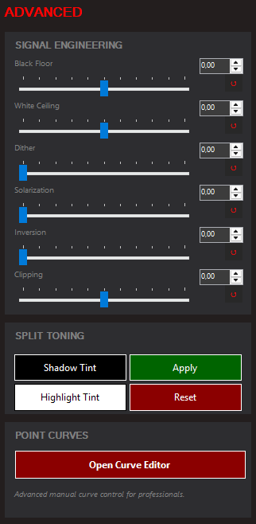

# Gamer Gamma v1.3

## The Philosophy: Retro Simplicity
Gamer Gamma is built for those who miss the "just works" efficiency of classic utilities like **Gamma Panel**. Unlike modern apps that are cluttered with 3D effects, heavy animations, and complex menus, Gamer Gamma goes back to basics: **Simple, high-response sliders that do exactly what they say.**

No 3D fluff. No account required. Just pure control over your pixels.

---

## Tactical Gaming Advantage: "Daylight in the Dark"
Built specifically for high-tension **FPS games (Valorant, CS2, Tarkov, Dark Souls)**, Gamer Gamma gives you a professional tactical edge:

*   **Black Stabilizer (LG-Style Logic)**: Unlike standard brightness, this uses a non-linear power curve to lift dark shadows. Enemies hiding in pitch-black corners become visible while preserving the overall contrast of the game.
*   **Smart Contrast (v1.3)**: A macro control that surgically balances Black Stabilization, Mid-Gamma, and Clarity into a single slider for instant visibility optimization.
*   **Point Curve Editor (v1.3)**: Professional-grade 10-bit precision curve editing. Sculpt your own response curves for each RGB channel with real-time "Show Output" feedback.

---

## User Guide: How It Works

### 1. Basic Image Tuning
*   **Master Gamma**: Adjusts the overall brightness response. Higher values lift the image, lower values deepen it.
*   **Brightness & Contrast**: Standard display gain and dynamic range controls.
*   **Hue**: Shifts the entire color spectrum. Use for correcting display tints or creative color grading.

### 2. The Stabilizer Suite
*   **Black Stabilizer**: The core tactical tool. Bends the bottom of the gamma curve to reveal details in shadows without washing out whites.
*   **White Stabilizer**: Bends the top of the curve. Prevents highlight clipping and protects your eyes from bright flashes.
*   **Mid-Gamma**: Adjusts the center of the image spectrum. Lift this for a "brighter" perceived image without losing true black depth.

### 3. Advanced Tools (v1.3)

*   **Smart Contrast**: A "One-Slider" solution for tactical visibility. It intelligently combines multiple stabilizer logics.
*   **Split Toning**: Separately tint Shadows and Highlights. Perfect for creating a "Warmer" or "Cooler" look while maintaining natural mid-tones.
*   **De-Haze**: Enhances clarity and removes "fog" from the image. Negative values can be used to soften harsh edges.
*   **Tone Sculpt**: Adds subtle micro-contrast "bumps" to the spectrum, making textures pop.
*   **Temperature & Tint**: Fine-tune color temperature for display correction or creative grading.

### 4. Precision Curve Mapping (v1.3)

Professional 10-bit precision **Point Curve Editor**:
*   **Per-Channel Editing**: Fine-tune Red, Green, Blue individually or link them for global master control
*   **10-Bit Spline Interpolation**: Silky smooth transitions between control points
*   **Live Output Feedback**: See the exact resulting curve in real-time as you adjust sliders
*   **Global Config Export/Import**: Save and share your custom curves as JSON

---

## System Integration
*   **Global Hotkeys**: Bind combinations (e.g., **Ctrl+1**) to switch profiles instantly mid-match.
*   **Automatic Persistence**: Remembers your settings for every monitor individually.
*   **Clean Operation**: 
    - **Start with Windows**: Launch automatically on boot
    - **Minimize to Tray**: Keep the UI out of your way (Lightbulb icon)
    - **Start Minimized**: Launch silently in the background
*   **No Background Process**: Apply your settings, then close the app completely—gamma adjustments persist without any running process!

---

## 📥 Download & Install

**Latest Release**: [v1.3 - Download GamerGamma.exe](https://github.com/omaxtr/GamerGamma/releases/download/1.3/GamerGamma.exe)

1. Download `GamerGamma.exe` from the releases
2. Run it - no installation needed!
3. Configure your settings
4. Enable "Start with Windows" for automatic startup (optional)

**File**: Standalone executable, no dependencies required  
**Framework**: .NET 4.8 (included in Windows 10/11 by default)  
**Size**: ~50KB  
**Platform**: Windows 10/11 (64-bit)

---

## FAQ

### Is this a Color Calibration software?
**No.** Gamer Gamma is a **Gamma Calibration and Tactical Utility**. While professional color calibration uses hardware to ensure "accuracy," Gamer Gamma is designed for **user-driven visibility**. It gives you the tools to intentionally bend display logic for gaming advantages or personal preference.

### Will this get me banned?
**No.** Gamer Gamma modifies your display output at the OS level, not game files or memory. You can apply your settings, then **close the application completely**—the gamma adjustments persist without any background process. Anti-cheat systems have no way to detect display-level changes.

### Will it affect my FPS?
**Zero impact.** Gamer Gamma uses low-level Windows APIs to communicate directly with your GPU's gamma ramp. It consumes virtually zero resources.

---

## Credits
**Gamer Gamma** is the spiritual successor to **Gamma Panel** (Original by Tomaž Šolc).

Built with ❤️ for gamers by gamers.  
**Implementation**: omaxtr  
**Logic Assistant**: Antigravity AI
